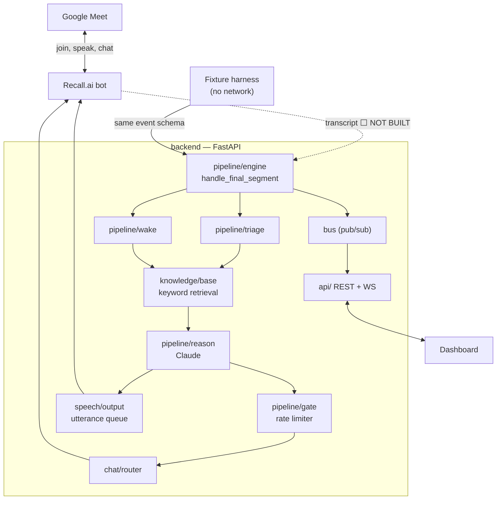

# meet_AGI — Design Doc

**A Google Meet copilot that actually speaks.**

The agent is called **Kindred**. The wake phrase is **"Hey AGI"** (with `Kindred` kept as
an alias).

> **Status: this document describes what is built.** Anything not yet implemented is
> marked ⬜ and says so plainly. Last reconciled against the code at commit `b469122`.
>
> **The one thing that is not built is the one that matters most: Kindred cannot hear a
> real meeting yet.** See §2.1.

---

## 1. What it is

Kindred joins a Google Meet as a participant, hears every speaker on a separate audio
track, knows who each person is, and stays quiet.

Two loops, one entry point (`pipeline.handle_final_segment`, called once per finalized
utterance):

**Ambient loop (silent, always on).** Triage every utterance for a checkable factual
claim, retrieve against the document corpus, ask Claude whether the evidence conflicts,
rate-limit, and if it survives all of that, type a one-line flag into the meeting chat
with the full reasoning in the dashboard.

**Speech mode (on demand).** Say "Hey AGI" and Kindred wakes, captures the question,
answers it out loud through Inworld TTS, and types a summary into chat.

The difference from every other notetaker: it participates.

---

## 2. Platform capabilities

Meeting I/O runs on **Recall.ai**. Verified against their docs, then against their API.

| Requirement | Platform | Built? |
|---|---|---|
| Bot joins meeting | ✅ Google Meet | ✅ `RecallClient.create_bot` |
| Bot speaks into meeting | ✅ | ✅ `output_audio`, mp3 base64 |
| Bot posts to in-meeting chat | ✅ `everyone`, 500 chars | ✅ `send_chat_message` |
| Bot leaves | ✅ | ✅ `leave_call` |
| Per-speaker separated audio, real-time | ✅ 16 speakers, 16 kHz mono PCM | ⬜ **not built** |
| Real-time transcript with speaker attribution | ✅ | ⬜ **not built** |

**Cost:** $0.50/hr recording, prorated to the second, first 5 hours free. Built-in
transcription +$0.15/hr. The whole hackathon including heavy iteration lands under $20.

### 2.1 The critical gap

**Kindred can join a meeting, speak into it, and type into its chat. It cannot hear it.**

`RecallClient` implements bot lifecycle, audio output, and chat. It does not open the
websocket that carries `audio_separate_raw.data` or `transcript.data`, so
`handle_final_segment` is currently only ever called by the fixture harness.

Everything downstream of the transcript — triage, retrieval, reasoning, the gate, wake
detection, speech, chat — is built and works. They are exercised end to end today by
replaying a fixture. Wiring the real transcript stream into the same function is the
single remaining step to a live demo, and it is the top of the build order in §11.

### 2.2 Constraints learned the hard way

1. **Google Meet chat caps at 500 characters.** This shaped the whole product: chat is an
   *alert* channel, the dashboard carries the argument. The cap is enforced in code
   (`chat.sinks.fit_to_limit`), not trusted to the model — a prompt that usually produces
   200 characters and occasionally produces 520 would silently drop that interjection, in
   the meeting, on stage. Truncation is on a word boundary.
2. **Recall requires `automatic_audio_output` at bot creation** or the on-demand audio
   endpoint is disabled for that bot's entire life. Every bot Kindred dispatches gets a
   silent clip in that slot to keep the path open.
3. **Recall API keys are region-scoped.** A key from another region returns 401 on every
   call, which reads exactly like a bad key. `RECALL_REGION` defaults to `us-west-2`.
4. **Real-time separate-audio excludes screenshare audio.** Live, Kindred is deaf to a
   shared video. It is in the post-call recording only. Don't demo a screenshared clip.
5. **Separate audio is compute-heavy — Recall recommends 4-core bots.** One config flag,
   and streams drop silently without it.
6. **Bot status is polled, not webhooked.** Webhooks need a public HTTPS endpoint, and
   requiring ngrok to be up before the bot can speak is exactly the kind of setup step
   that eats a demo. Transcript ingestion will need that tunnel; audio output does not.

---

## 3. Architecture



### Module map

| Module | Job |
|---|---|
| `ingest/harness.py` | Fixture replay. Emits the real event stream with no network. |
| `pipeline/engine.py` | The one entry point. Dispatches ambient vs speech, per-meeting lock. |
| `pipeline/wake.py` | Wake detection with homophone variants and a positional guard. |
| `pipeline/triage.py` | Is this a checkable claim? Heuristic first, then a cheap model. |
| `pipeline/reason.py` | The two Claude calls: `check_claim`, `answer_question`. |
| `pipeline/gate.py` | Rate limiter: confidence, cooldown, per-meeting cap. |
| `pipeline/context.py` | Conversation memory for the current meeting. |
| `knowledge/base.py` | Loads, chunks, and keyword-retrieves the `.txt` corpus. |
| `speech/output.py` | Utterance queue — one clip at a time, in order, mute-aware. |
| `chat/` | Where a `chat_alert` goes. Enforces the 500-char cap. |
| `integrations/recall/` | Bot lifecycle, audio out, chat out. Polls status. |
| `providers/voice/` | `inworld` \| `sample` \| `auto`. |
| `providers/llm/` | Claude via the Anthropic SDK. |
| `api/`, `bus.py`, `store.py`, `schemas/` | Contract, transport, state. |

### Why the harness is a first-class component

You cannot iterate on reasoning quality by hosting a live Google Meet every time. The
engine's entry point accepts finalized segments from either source.

- The frontend is built end to end with no meeting, no key, no internet.
- Reasoning iteration costs nothing and needs no coordination.
- You get a deterministic, rehearsed demo path if conference wifi fails.

`fixtures/meetings/q3_revenue_review.jsonl` is a four-person quarterly review that plants
a contradiction, two wake events, and an unmatched dial-in participant, so every UI state
has data. When `ANTHROPIC_API_KEY` is set the harness runs the **real** pipeline over the
fixture transcript; without it, it falls back to canned output with the same event shapes.

---

## 4. The ambient loop

Runs on every finalized utterance that is not a wake.

1. **Remember** — the utterance joins the meeting's conversation context.
2. **Triage** — is there a checkable factual assertion here? The heuristic runs first and
   unconditionally because it is free: utterances under 8 words are out, pure
   back-channel ("yeah", "sounds good") is out. Only survivors reach a model, and only
   the cheap one. *The ordering is the whole optimization — you should not pay
   frontier-model prices to decide whether "yeah, sounds good" needs fact-checking.*
3. **Retrieve** — keyword prefilter over the corpus. Deliberately not semantic search:
   it exists to keep the prompt small, not to be the final word on relevance. Claude reads
   what survives and decides what matters. Recall beats precision here — a chunk wrongly
   included costs a few hundred tokens; a chunk wrongly excluded is a fact Kindred cannot
   see.
4. **Reason** — Claude returns a structured verdict, and the only verdict that interjects
   is **contradiction**: two specific statements that cannot both be true, each quoted
   verbatim, one from the transcript or the corpus and one from the utterance under
   review. There is no `context` verdict and no `correction` verdict any more. A model
   that flags a conflict but cannot produce both statements has reasoned its way to a
   conclusion rather than read one off the page, and the verdict is dropped in
   `Verdict.is_flag` before it ever reaches the gate. Everything else — useful nuance,
   a related figure, a qualification worth hearing — stays quiet. The bar for
   interrupting people is a contradiction or nothing.
5. **Gate** — drop it unless confidence clears `min_confidence`, the cooldown has
   elapsed, and the per-meeting cap is not hit. **Answers to direct questions bypass the
   gate** — if someone asks, Kindred replies. Only unprompted interjections are rationed.
6. **Emit** — one interjection, two artifacts:
   - `chat_alert` → the meeting. A flag, not an argument. Hard-capped at 500 chars.
   - `headline` + `body_md` + `citations` → the dashboard over WebSocket.

Reasoning is dispatched as a task per utterance behind a per-meeting lock, so it never
blocks transcript ingestion and two interjections cannot interleave. Nothing in the
pipeline raises into its caller: a meeting that keeps running with a degraded copilot
beats one where a reasoning exception stops the transcript.

**The rate limiter is a feature.** A copilot that will not shut up is worse than no
copilot. Defaults: `min_confidence 0.7`, `cooldown 90s`, `max 8 per meeting`, all live-
tunable from the settings UI — the right cooldown for a four-person review is not the
right cooldown for a standup, and you find that out during the meeting.

**Autonomy levels** (`settings.autonomy`, default `auto_post`):

- `silent` — dashboard only. Nothing reaches the meeting.
- `propose` — interjections wait for a human to approve, who may edit the alert first.
- `auto_post` — straight to chat. The real product, and the demo.

---

## 5. Speech mode

State machine on `agent_state`: `idle → listening → thinking → speaking → idle`, with
`muted` as a hard override.

### Wake detection

Matched against **finalized transcript only**. Partials revise as they arrive, and a
partial that briefly reads `"hey a g..."` fires a wake the final then contradicts. This
is the single likeliest thing to embarrass you on stage.

Four problems a naive substring check does not solve:

**STT mangles "AGI".** It is three letters, not a word, so real transcripts come back as
`hey a g i`, `hey agi`, `hey aji`, `hey adji`. The variant set is generated from the
configured wake word plus a homophone list, so changing the wake word in settings does
not silently break matching.

**The homophone list is never complete.** Providers invent spellings nobody anticipated —
`hey ajai`, `hey hgi`, `hey agie`. After the exact pass there is a fuzzy pass: strip the
spaces out of a candidate token window and compare it to the wake phrase by edit
distance. `heyaji` is one edit from `heyagi` and wakes; `heygigi` is two and does not.
The fuzzy pass is held to a higher bar for what may follow it, since it is the pass that
can invent a wake out of an unrelated word.

**People say the wake word while talking about it.** "We should call it Hey AGI" must not
wake. The guard is positional: the phrase must start the utterance or follow a clause
boundary — which is where someone addressing the agent mid-sentence ("hold on, hey AGI,
what does the deck say") actually puts it. Distinctiveness belongs to the *configured*
phrase, not the variant: "Hey AGI" is two words and nothing anybody says by accident,
`Kindred` is one ordinary English word, and the mangled spelling `kin dread` inherits the
latter's caution however STT chose to tokenize it.

**A wake word only reaches this code if the utterance ever ends.** With an open
microphone it does not: words keep landing inside the silence gap and reset it, the
ingest buffer grows forever, and nothing is ever flushed. That is the "it only responds
if you mute at the end" bug, and it is fixed at the ingest boundary rather than here —
see §7.

Belt and braces on top: a **manual wake button** and a **mute kill switch** in the
dashboard, plus `POST /ask` to type a question directly. All three are stage insurance,
and all three should be visible controls, not debug tools.

### "AGI, stop talking"

The kill phrase, and the one signal deliberately matched on **partial** transcript. The
rule is a name plus a stop verb within a few tokens, in either order — `AGI stop
talking`, `Hey AGI, stop`, `stop talking, AGI`, `Kindred, that's enough`. Requiring the
name is what keeps "okay everyone, stop talking over each other" from muting the agent.

Waiting for the finalized utterance here would be exactly wrong. Everything the phrase
does is an abort, so a false positive costs silence and a false negative means Kindred
talks over the person telling it to shut up.

It aborts three things, in this order:

1. **Reasoning in flight** is cancelled, so a half-generated answer cannot land thirty
   seconds later in a room that asked for silence.
2. **The pending-question window** is dropped, so the next thing anybody says is not
   mistaken for the question Kindred was still waiting on.
3. **Audio** — the queue is discarded *and* the clip already playing is retracted through
   Recall's `DELETE /bot/{id}/output_audio/`. Without that last step the interruption is
   only a promise to stop at the end of the sentence.

`POST /api/meetings/{id}/interrupt` is the same path from the dashboard, skipping the
debounce that exists to absorb the phrase arriving repeatedly as partials revise.

### Answering

Retrieve → Claude → Inworld TTS → mp3 → Recall. The answer is persisted as an
`Interjection` with `kind: "answer"` and an `Utterance` recording the audio event, so the
dashboard timeline shows everything Kindred said and why.

⬜ **Clarifying questions are not built.** The design holds — at most one round, because
a bot that interrogates you is a bad demo — but it is not implemented.

---

## 6. Sponsors

All three sit behind provider seams. Only one is required to qualify.

### Inworld — voice. ✅ Built and load-bearing.
`providers/voice/inworld.py`. Kindred's actual speaking voice. `VOICE_PROVIDER=auto`
uses Inworld when `INWORLD_API_KEY` is set and falls back to pre-baked sample clips
otherwise, so the audio path works with no key at all.

### Tenstorrent — reasoning. ✅ Built.
`providers/llm/tenstorrent.py`. Qwen on Tenstorrent hardware, through the
OpenAI-compatible endpoint at `console.tenstorrent.com/v1`, behind the same
`complete_json` contract as Gemini and Claude. Flip `LLM_PROVIDER=tenstorrent` and every
reasoning call in both loops — triage, ambient, speech — goes to Tenstorrent instead.

It landed as a whole-pipeline provider rather than the triage-only seam originally
planned. `pipeline/triage.py` is still the best *argument* for the hardware — highest-QPS
decision in the system, small-model classification, runs on every utterance forever — but
the seam that already existed was `LLM_PROVIDER`, and a second parallel switch for one
call site would have been the worse design. `settings.triage.provider` remains a runtime
knob for choosing heuristic-vs-model; it does not pick the vendor.

Two things about the endpoint are load-bearing and are documented at length in the
provider module, because both fail silently:

- **Thinking is on by default and must be turned off** via `chat_template_kwargs`. A
  schema-constrained call with thinking enabled took 125s and still ran out of tokens
  mid-object; the reasoning trace spends the whole `max_tokens` budget before the answer
  starts, so it presents as truncated JSON rather than as a latency problem.
- **`response_format` is enforced by `Qwen/Qwen3-32B` and ignored by
  `Qwen/Qwen3-VL-32B-Instruct`.** The VL model is the newer of the two in the catalogue
  and returns HTTP 200 with whatever shape it likes. Every call this pipeline makes is
  schema-constrained, so Qwen3-32B is the default. `GET /v1/models` is the catalogue.

Measured against the real schemas: triage 1.8s, ambient 14.0s, speech answer 9.3s. The
answer path is over the §7 budget — see the note there.

### Character.AI — persona. ⬜ Settings field only.
`settings.persona` exists in the contract; there is no `providers/persona/`. The intent
stands: Claude reasons, Character.AI shapes tone. Keeping them separate matters — you do
not want persona bleeding into analytical accuracy.

### Claude — the reasoning itself. ✅ Built.
`claude-opus-5` for interjections and answers, `claude-haiku-4-5` for triage.

---

## 7. Latency budget for speech mode

What separates "impressive" from "awkward", measured from question-end to first audio:

| Stage | Expected |
|---|---|
| Transcript finalize → backend | 300–800 ms |
| Keyword retrieval | ~10 ms |
| Claude first sentence | ~600 ms |
| Inworld TTS first chunk | 200–500 ms |
| Recall `output_audio` → audible | 500–1000 ms |
| **Total to first audio** | **~2–3 s** |

⬜ **Sentence-level streaming is not built.** Today an answer is synthesized as one clip
and played when complete, which pushes first-audio to roughly 5–7s on a long answer.
Generating sentence-by-sentence and playing each as it completes is the fix. Treat it as
required before demo, not a nice-to-have.

⚠️ **On Tenstorrent the answer call alone is ~9.3s** (measured, `Qwen/Qwen3-32B`, thinking
off, real `ANSWER_SCHEMA`). That is over budget on its own, before TTS or Recall playback.
The filler line — "let me look that up", pre-rendered at startup — is what makes this
survivable, and it becomes load-bearing rather than polish when `LLM_PROVIDER=tenstorrent`.
Gemini remains the default for speech mode.

`speech_tail_padding_ms` exists because Recall buffers and mixes audio: playback finishes
slightly after the POST returns, and without padding back-to-back clips clip each other's
tails.

---

## 8. API contract

**This is the coordination boundary.** The frontend is built against this without reading
backend code.

**Source of truth:** Pydantic models in `backend/app/schemas/`. FastAPI derives OpenAPI;
`./scripts/gen-types.sh` derives `frontend/src/lib/api/generated.ts`. Both `openapi.json`
and the generated TypeScript are committed, so the frontend always has current types even
when the backend is not running.

**Conventions**
- Base path `/api`. JSON except multipart upload.
- IDs are prefixed ULIDs: `prs_`, `doc_`, `chk_`, `mtg_`, `seg_`, `itj_`, `utt_`.
- Timestamps are RFC 3339 UTC with exactly milliseconds: `2026-08-01T18:22:04.118Z`.
- Errors are always `{"error": {"code", "message", "detail"}}`.
- Lists are `{"items": [...], "next_cursor": null}`. Cursors are opaque.
- **All mutations are REST. The WebSocket is server-to-client only.** One write path.

### 8.1 Endpoints

The authoritative list is `openapi.json` / http://localhost:8000/docs. Current surface:

```
GET    /api/health

GET    /api/people                              POST   /api/people
GET    /api/people/{id}                         PATCH  /api/people/{id}
DELETE /api/people/{id}                         POST   /api/people/{id}/voice-sample

GET    /api/documents                           POST   /api/documents          (multipart)
GET    /api/documents/{id}                      PATCH  /api/documents/{id}
DELETE /api/documents/{id}

GET    /api/integrations                        POST   /api/integrations/{provider}/connect
DELETE /api/integrations/{provider}

GET    /api/settings                            PATCH  /api/settings

GET    /api/meetings                            POST   /api/meetings
GET    /api/meetings/{id}                       POST   /api/meetings/{id}/leave
GET    /api/meetings/{id}/transcript            GET    /api/meetings/{id}/interjections
GET    /api/meetings/{id}/utterances

POST   /api/meetings/{id}/wake                  POST   /api/meetings/{id}/mute
POST   /api/meetings/{id}/ask                   POST   /api/meetings/{id}/interrupt
POST   /api/meetings/{id}/speak                 POST   /api/meetings/{id}/speak/random
GET    /api/speech/clips

POST   /api/interjections/{id}/approve          POST   /api/interjections/{id}/dismiss
POST   /api/interjections/{id}/speak

GET    /api/dev/fixtures                        POST   /api/dev/reset
POST   /api/dev/harness/start                   POST   /api/dev/harness/stop

WS     /api/meetings/{id}/live                  WS     /api/live
GET    /api/_schema/live-event                  GET    /api/_schema/client-message
```

The two `_schema` endpoints are never called. They exist so the WebSocket event union
lands in OpenAPI — see §8.3.

### 8.2 Central objects

**`Interjection`** — a conclusion. `kind` ∈ `contradiction | context | correction |
answer | clarification`; `status` ∈ `proposed | approved | posted | dismissed | failed`.
Carries `chat_alert` (≤500 chars, what the meeting saw), `headline`, `body_md`,
`confidence`, `citations[]`, and `trigger` (the quote that caused it).

The ambient loop now only ever emits `contradiction`, and speech mode only ever emits
`answer`. `context` and `correction` stay in the enum because removing an enum variant is
a breaking change for a generated client and this one costs nothing to keep — but nothing
produces them, and a frontend need not render them.

**`Utterance`** — an audio event. Deliberately separate from `Interjection`: an
interjection is a conclusion, an utterance is the sound that carried it. `status` ∈
`queued | speaking | played | dropped | failed`. `placeholder: true` means the audio is a
stand-in that does not say `requested_text` — the UI should label it rather than
presenting it as real speech.

**`Meeting`** — `state` ∈ `scheduled | joining | in_call | ended | failed`;
`agent_state` ∈ `idle | listening | thinking | speaking | muted`; `source` ∈
`recall | harness`. `roster[]` entries carry `matched` and `person_id`.

**`TranscriptSegment`** — partials and their final share an `id`, so a final replaces the
partial it supersedes.

**`Settings`** — `wake_word` (default `"Hey AGI"`), `wake_aliases` (default `["Kindred"]`),
`wake_word_enabled`, `autonomy`, `interjection` policy, `voice`, `persona`, `triage`.

### 8.3 WebSocket

One envelope for every frame:

```jsonc
{ "type": "transcript.final", "seq": 1428, "meeting_id": "mtg_…",
  "ts": "2026-08-01T18:22:04.118Z", "data": { /* per type */ } }
```

Exactly one `snapshot` on connect carries full state, so no REST round-trip is needed to
initialize. Reconnect with `?since_seq=N` to replay from a 500-frame buffer; if that point
is evicted the server sends a fresh `snapshot` and the client must reset. `seq` is
monotonic — a gap means dropped frames, so reconnect rather than reconcile.

| `type` | `data` |
|---|---|
| `snapshot` | `{meeting, recent_segments[], interjections[]}` |
| `meeting.state_changed` | `{state, agent_state, error?}` |
| `participant.joined` / `.left` / `.speaking_changed` | roster deltas |
| `transcript.partial` / `.final` | `TranscriptSegment` |
| `interjection.proposed` / `.updated` | `Interjection` |
| `agent.state_changed` | `{agent_state, detail?}` |
| `speech.wake_detected` | `{participant_id, person_id?, segment_id, matched_text}` |
| `speech.question_captured` / `.clarification_asked` / `.answered` | speech-mode progress |
| `document.status_changed` | `Document` (global stream) |
| `error` | `{code, message}` |

**OpenAPI cannot describe sockets**, so `LiveEvent` would never reach the generated client
and would have to be hand-written. The `_schema/live-event` anchor endpoint solves this:
its response model *is* the union, and the frontend extracts the discriminated union from
that response type. **Adding an event type in Python therefore needs no frontend edit.**

### 8.4 Change discipline

- Adding a field, enum variant, or event type: **free, unannounced**.
- Renaming or removing anything: **tell the other developer first.**
- Run `./scripts/gen-types.sh` after any schema change and commit the output.
- `switch` on `event.type` **with a `default` branch** — new types will arrive.

---

## 9. Frontend

### Config (`/settings`)
People (name, role, org, bio, aliases — fed to the reasoning model as speaker context),
documents (drag-drop, status chip, tags), integrations (cards; "Demo" badge driven by
`is_stub`, never hardcoded), and agent settings (wake word, autonomy with plain-language
descriptions, confidence, cooldown, voice, persona tone).

### Live meeting view (`/meetings/[id]`)
The demo screen. Entirely WebSocket-driven.

- **Agent state pill** — `idle`/`listening`/`thinking`/`speaking`/`muted`, distinct
  colors. This pill *is* the demo: the audience watches it flip to `listening` the instant
  someone says "Hey AGI".
- **Roster** — live speaking indicators, matched role, unmatched participants flagged.
- **Transcript** — partials as a dim live line per speaker that solidifies on final.
- **Interjection feed** — the payoff. Headline, confidence, triggering quote, `body_md`,
  expandable citations, the verbatim `chat_alert`, and approve/dismiss under `propose`.
- **Controls** — mute, manual wake, ask box. Stage insurance; make them visible.

The interjection card is what people screenshot. It carries the argument chat's 500
characters cannot. Give it the most design attention.

---

## 10. Stack

| Layer | Choice |
|---|---|
| Backend | Python 3.11+, FastAPI, Pydantic v2, uvicorn |
| State | **In-memory, seeded.** No database. Restart clears everything. |
| Retrieval | Keyword prefilter over `.txt` in `knowledge/`. ⬜ Not pgvector. |
| Frontend | Contract layer shipped; app framework is the frontend owner's call |
| Contract | OpenAPI → `openapi-typescript` |
| Reasoning | Gemini by default; `LLM_PROVIDER` switches to Claude or Tenstorrent Qwen |
| Voice | Inworld, with pre-baked sample clips as fallback |
| Meeting I/O | Recall.ai |

Postgres + pgvector remains the right answer at scale and is what §11 milestone 3 was.
For a hackathon corpus of a few documents, keyword retrieval into a Claude context window
is faster to build, has no infrastructure, and is good enough — Claude does the relevance
judgement anyway.

---

## 11. Build order

| # | Milestone | State |
|---|---|---|
| 0 | Schemas, OpenAPI, generated TS, fixture harness | ✅ done |
| 1 | Config CRUD | ✅ done, in-memory |
| 2 | Harness emits the full live event stream | ✅ done |
| 3 | Document corpus + retrieval | ✅ keyword; ⬜ pgvector deferred |
| 4 | Ambient loop: triage → reason → gate → interjection | ✅ done |
| 5a | Recall bot join, audio out, chat out | ✅ done |
| **5b** | **Recall real-time transcript ingestion** | ⬜ **not built — top priority** |
| 6 | Chat alert posting | ✅ done |
| 7 | Speech mode: wake → answer → Inworld → meeting | ✅ done |
| 8 | Sentence-level streaming for speech | ⬜ not built |
| 9 | Clarifying questions | ⬜ not built |
| — | Config UI, live meeting view | 🟡 frontend owner |

**5b is the critical path.** Everything downstream of it is built and tested against the
harness. Until it lands, Kindred is deaf in a real meeting and the demo has to be driven
by `POST /ask` and the manual wake button.

**Cut list, in order:** clarifying questions → Character.AI persona → Tenstorrent triage →
sentence streaming. Do not cut 5b or 7.

---

## 12. Risks

| Risk | Severity | Mitigation |
|---|---|---|
| **5b doesn't land** — Kindred can't hear the live meeting | **High** | `/ask` + manual wake drive the demo entirely from the dashboard; harness gives a full offline path |
| Wake false-positive on stage — someone says "Hey AGI" while explaining it | **High** | Finalized-transcript-only matching, positional guard, homophone variants, mute switch, manual wake |
| Transcript ingestion needs a public `wss://` | Medium | ngrok early; audio output deliberately does not depend on it |
| Speech latency feels dead | Medium | Sentence streaming (#8); measure first-audio explicitly |
| Kindred interjects too much | Medium | Gate: confidence + cooldown + cap, tunable live |
| No persistence — a restart loses the meeting | Medium | Accepted for the hackathon. Do not restart the backend mid-demo. |
| Conference wifi | Medium | Fixture harness is a fully offline demo path |
| 500-char alerts feel thin | Low | By design: chat alerts, dashboard argues |
| Screenshare audio invisible live | Low | Documented; don't demo a shared video |

---

## 13. Open questions

1. ~~**Tenstorrent credentials**~~ — resolved. Key is in `.env`, provider is built, and
   `LLM_PROVIDER=tenstorrent` routes both loops to Qwen3-32B. Open sub-question: the
   answer path is ~9.3s (§7), so whether Tenstorrent drives the *demo* or just proves the
   integration depends on whether sentence-level streaming lands first.
2. **Consent disclosure** — Recall can pin a chat message on join, and `--announce
   greeting` can speak one. Recommend turning one on by default; it preempts the obvious
   judge question about recording people.
3. **Cross-meeting memory** — `pipeline/context.py` is per-meeting. "Kindred remembers
   what you said three meetings ago" is a strong demo beat and a schema addition. Decide
   before the frontend hardens.
4. **Persistence** — worth it before demo day, or is in-memory acceptable given a restart
   loses everything?
